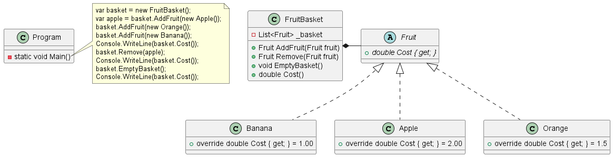

# Fruit Basket Polymorphism Lab

## Overview

In this lab, you will work with concepts such as polymorphism, abstraction, and encapsulation to create a C# program
that simulates a fruit basket. Your goal is to build out a series of classes that interact with each other, adhere to
principles of object-oriented programming, and solve the problem at hand.

## Starter Code

Your starting point includes a partially implemented `Fruit` abstract class and a partially implemented `FruitBasket`
class. You will also find a `Program` class with a `Main` method waiting for your implementation.

```csharp
namespace FruitBasket
{
   public abstract class Fruit
   {
      public abstract double Cost { get; }
   }
}
using System.Collections.Generic;
using System.Linq;
namespace FruitBasket
{
    internal class FruitBasket
    {
        private readonly List<Fruit> _basket = new();
        public Fruit Add(Fruit fruit)
        {
            _basket.Add(fruit);
            return fruit;
        }
        //TODO: Create Remove, Empty and Cost methods
    }
}
namespace FruitBasket
{
    internal static class Program
    {
        private static void Main()
        {
            //TODO: Add implementation
        }
    }
}
```

## Requirements

Your tasks are as follows:

1. Extend the `Fruit` class to create three new classes: `Apple`, `Banana`, and
   `Orange`. Each class should override the `Cost` property to return a different value.
2. See page 476 of the textbook for discussion on Abstract Properties.
3. In the `FruitBasket` class:
    - Implement the `Remove` method which should take a `Fruit` object as a parameter, remove it from the basket, and
      return it.
    - Implement the `EmptyBasket` method to remove all fruits from the basket.
    - Implement the `Cost` method to return the total cost of all fruits in the basket.
4. In the `Program` class, within the `Main` method:
    - Create a new `FruitBasket` instance.
    - Create instances of `Apple`, `Banana`, and `Orange`, and add them to the basket.
    - Print the total cost of fruits in the basket to the console.
    - Remove an apple from the basket and then print the total cost to the console again.
    - Empty the basket and print the total cost to the console once more.

## Hints

- You can use a `foreach` loop to iterate over all the fruits in the basket and calculate the total cost.
- For removing a specific fruit object from the list, you can use the `Remove` method of the List class.
- To clear all objects from the list, use the `Clear` method of the List class.
- Here is an example of how you can implement the `Apple` class:

```csharp
namespace FruitBasket
{
    public class Apple : Fruit
    {
        public override double Cost { get; } = 2.00;
    }
}
```

You may use my implementation for your Program class and Main() method below:
